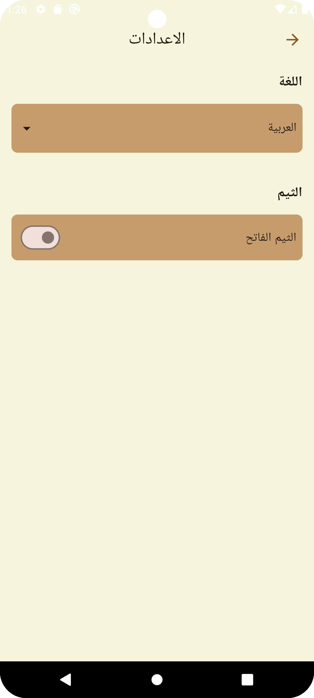

# Egypt Tourist Guide - Mobile Application

The Egypt Tourist Guide is a mobile application designed to provide tourists with an easy and
personalized way to explore Egypt's landmarks, museums, and attractions across different
governorates. The app features user-friendly navigation, a favorites system, and curated suggestions
to enhance the tourism experience.

---

## Features

### 1. Authentication

- *Signup Page*:
    - Input fields: Full Name, Email, Password, Confirm Password, Phone Number.
  - Data is saved in **Firebase Authentication** and **Firestore**, and users are redirected to the
    Login Page after signup.
- *Login Page*:
    - Input fields: Email, Password.
  - Validates user credentials using **Firebase Authentication** and redirects to the Home Page upon
    successful login.

### 2. Profile Page

- Displays user information, including:
    - Full Name
    - Email
    - Address
    - Phone Number
    - Password (hashed for security).
- Data is fetched and updated from **Firestore**.

### 3. Localization

- Supports both Arabic (Ar) and English (En).

### 4. Theme Customization

- Toggle between light and dark themes using ThemeBloc.

### 5. Landmarks/ Home Page

- Shows landmarks or places and add them to favorites.

---

## State Management (Blocs)

The application employs flutter_bloc for efficient state management:

- **AuthBloc**:
    - States: AuthInitial, AuthLoading, AuthAuthenticated, AuthUnauthenticated, AuthError.
  - Events: LoginButtonPressed, SignUpButtonPressed, SignOutEvent.
- *ProfileBloc*:
    - States: ProfileInitial, ProfileLoading, ProfileLoaded, ProfileUpdated, ProfileError.
    - Events: LoadProfile, UpdateProfile, UpdateAvatar.
- *ThemeBloc*:
    - States: ThemeLight, ThemeDark.
    - Events: ToggleTheme.
- *PlacesBloc*:
    - Events: LoadLandmarks.
    - States: LandmarksLoading, LandmarksLoaded, LandmarksError.
- *ChangeLanguageCubit*:
    - States: ChangeLanguageState.
- *FavoritesBloc*:
    - States: ChangeLanguageState.
    - Events: FavoriteLandmarksInitial, FavoriteLandmarksUpdated.


---

## Navigation Flow

- *Signup Page* → *Login Page* → *Home Page*
- *Home Page* → *Profile Page* → *Edit Profile Page*
- *Edit Profile Page* → *Settings Page*

---

# Flutter Packages Used in the Project

## 1. **flutter_bloc**

Provides state management for implementing BLoC (Business Logic Component).

- **Purpose**: Helps in managing and separating business logic from UI.
- **Documentation**: [flutter_bloc Documentation](https://pub.dev/packages/flutter_bloc)

### 2. **firebase_core**

Required for Firebase integration.

- **Purpose**: Initializes Firebase in the app.
- **Documentation**: [firebase_core Documentation](https://pub.dev/packages/firebase_core)

### 3. **firebase_auth**

Handles user authentication (login, signup, logout).

- **Purpose**: Manages user authentication using Firebase.
- **Documentation**: [firebase_auth Documentation](https://pub.dev/packages/firebase_auth)

### 4. **cloud_firestore**

Stores user profile data and other information.

- **Purpose**: Manages Firestore database operations.
- **Documentation**: [cloud_firestore Documentation](https://pub.dev/packages/cloud_firestore)

### 5. **intl**

Supports internationalization and localization for dates, numbers, and messages.

- **Purpose**: Helps in formatting dates, times, and messages according to the locale.
- **Documentation**: [intl Documentation](https://pub.dev/packages/intl)

### 6. **google_fonts**

Enables easy use of Google Fonts in the app.

- **Purpose**: Provides access to a wide range of custom fonts to enhance app design.
- **Documentation**: [google_fonts Documentation](https://pub.dev/packages/google_fonts)

### 7. **intl_phone_number_input**

A widget for phone number input with international formatting support.

- **Purpose**: Allows users to input and validate phone numbers in international formats.
- **Documentation
  **: [intl_phone_number_input Documentation](https://pub.dev/packages/intl_phone_number_input)

### 8. **flutter_localizations**

Provides tools for localizing Flutter apps for multiple languages.

- **Purpose**: Enables apps to support different languages and locales.
- **Documentation
  **: [flutter_localizations Documentation](https://docs.flutter.dev/development/accessibility-and-localization/internationalization)

### 9. **shared_preferences**

Used for storing key-value data persistently on the device.

- **Purpose**: Allows saving small amounts of data like user preferences locally.
- **Documentation**: [shared_preferences Documentation](https://pub.dev/packages/shared_preferences)

---

## Architecture

The app is built using the *Clean Architecture*, ensuring a clear separation of concerns for better
maintainability and scalability.

- *Models*: Define the structure of data (e.g., Landmarks, Users).
- *Views*: Handle the UI components (e.g., screens and widgets).
- **Data**: Handle data storage and retrieval (e.g., Firestore, SharedPreferences).
- **Services**: Handle business logic (e.g., Authentication, Landmark Service).

---

## File Structure

```plaintext
lib/
├── data/
├── generated/
├── l10n/
├── services/
├── models/
├── views/
│   ├── blocs/
│   │   ├── auth/
│   │   ├── profile/
│   │   ├── theme/
│   │   ├── landmarks/
│   │   └── favorite/
│   ├── cubits/
│   │   └── changeLanguage/
│   ├── screens/
│   └── widgets/
└── main.dart

```
## User Profile Management

### Features

1. *API & Data Handling*:
    - Implemented using Dio for API requests.
   - Implemented using Firebase Firestore for data storage.
    - Parsing and modeling JSON data.
    - Error handling using try-catch blocks.

2. *Add & Edit User*:
    - Full CRUD operations for user profiles: Create, Read, Update, and Delete.
    - Data caching with SharedPreferences for offline support.

3. *User Details*:
    - Pass data between screens efficiently.
    - Manage states for seamless user experience.

---

## Screenshots

| Login                                        | Sign                                       | Logout                                         | Profile                             | Localization                                  |
|----------------------------------------------|--------------------------------------------|------------------------------------------------|-------------------------------------|-----------------------------------------------|
|  |  |  |  |  |

| Settings                              | Theming                             | Successful Login                                   |
|---------------------------------------|-------------------------------------|----------------------------------------------------|
|  |  |  |

---

